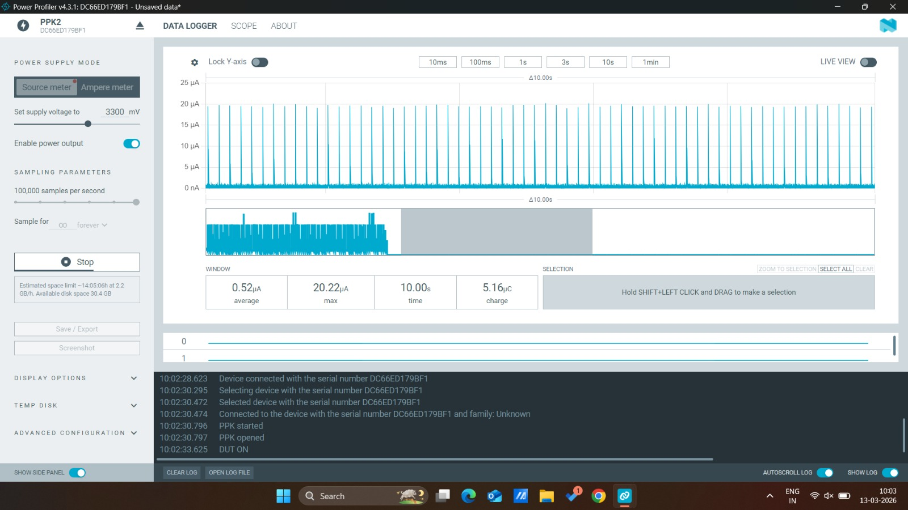

# Bluefruit ISC-NRF52832 BLE Beacon with Ultra-Low Power Sleep

A power-efficient BLE beacon implementation for ISC-nRF52832 that alternates between active BLE advertising and ultra-low power system sleep mode.

## Overview

This project demonstrates how to create a BLE beacon that maximizes battery life by spending minimal time broadcasting and the majority of time in a deep sleep state. The device wakes up on demand via a GPIO pin interrupt.

## Features

 **Efficient Power Management**
- **Active BLE Mode**: ~2 mA (10 seconds of advertising)
- **System OFF Sleep**: ~0.53 µA (ultra-low power deep sleep)
- **Battery Life**: Significantly extended with intermittent operation

 **BLE Beacon Broadcasting**
- Non-connectable, scannable BLE beacon
- Configurable UUID, Major, and Minor values
- Compatible with standard BLE beacon apps (nRF Beacon, etc.)

 **Programmable Advertising Duration**
- Default: 10 seconds of advertising per cycle
- Easily customizable via `ADV_DURATION_MS` macro

 **Hardware Wake-up**
- GPIO5 (or any GPIO pin) based wake-up
- Pull-down input configuration
- Wakes on HIGH logic level

## Hardware Requirements

- **ISC-nRF52832**
- **Arduino IDE** with Adafruit nRF52 board support installed
- **Bluefruit LE Libraries** (included in Adafruit nRF52 BSP)
- Optional: Button or switch connected to GPIO8 for wake-up testing


## Hardware Connection

### GPIO5 Wake-up Configuration

```
ISC- nRF52832
┌──────────────────┐
│    3.3V          │
│     ↓            │
│  [Button/Jump]   │  (Press to wake)
│     ↓            │
│    GPIO8         │
└──────────────────┘
```

**When GPIO8 goes HIGH** → Device wakes from System OFF sleep

## Power Consumption Analysis

### Active Advertising Mode
- **Current Draw**: ~2 mA
- **Duration**: 10 seconds per cycle
- **Energy per cycle**: 2 mA × 10 sec = 20 mAh consumed

### System OFF Sleep Mode
- **Current Draw**: ~0.53 µA (extremely low!)
- **Duration**: Variable (until wake-up)

